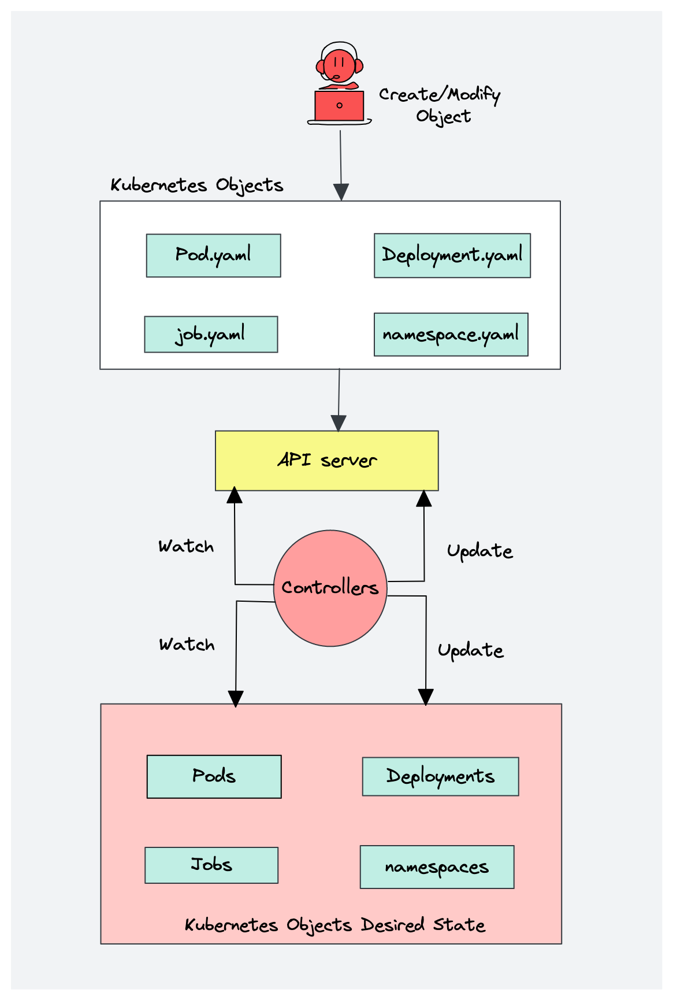

<!-- PROJECT LOGO -->
<br />
<div align="center">
 <a href="https://github.com/thanhtn208/Introduction-to-Kubernetes/tree/main/Concept">
   
 </a>

<h3 align="center">Introduction to Kubernetes</h3>

 <p align="center">
   The code review and content of Introduction Kubernetes course...
 </p>
</div>
<br>
<div id="top">
<!-- TABLE OF CONTENTS -->
<details>
 <summary>Table of Contents</summary>
 <ol>
 <li>
     What is Kubernetes?
     <ul>
       <li><a href="#What-is-Kubernetes-What-Problems-Kubernetes-solves">What Problems Kubernetes solves?</a></li>
       <li><a href="#What-is-Kubernetes-What-features-orchestration-tools-offer">What features orchestration tools offer?</a></li>
     </ul>
 </li>
 <li>
     Kubernetes Architecture
     <ul>
       <li><a href="#Kubernetes-Architecture-Node-Processes">Node Processes</a></li>
       <li><a href="#Kubernetes-Architecture-Master-Processes">Master Processes</a></li>
     </ul>
 </li>
 <li>
     Manage K8s Components - kubectl & Config File
     <ul>
       <li><a href="#kubectl-Config-File-Kubernetes-CLI">Kubernetes CLI</a></li>
       <li><a href="#kubectl-Config-File-K8s-Configuration-file">K8s Configuration file</a></li>
       <li><a href="#kubectl-Config-File-Imperative-vs-Declarative">Imperative vs Declarative</a></li>
     </ul>
 </li>
 <li>
     Kubernetes Installation Steps
     <ul>
       <li><a href="#Kubernetes-Installation-Steps-What-we-need-to-install">What we need to install</a></li>
       <li><a href="#Kubernetes-Installation-Steps-Static-Pods">Static Pods</a></li>
       <li><a href="#Kubernetes-Installation-Steps-Certificates">Certificates</a></li>
       <li><a href="#Kubernetes-Installation-Steps-Kubeadm">Kubeadm</a></li>
     </ul>
 </li>
   <li>
       Preparing Servers
     <ul>
       <li><a href="#disable-memory-swap">Disable memory swap</a></li>
       <li><a href="#edit-hosts-file">Edit hosts file</a></li>
       <li><a href="#edit-hosts-names">Edit machine names</a></li>
       <li><a href="#prepare-installing-container-runtime">Prepare installing container runtime</a></li>
       <li><a href="#install-containerd">Install Containerd</a></li>
       <li><a href="#install-3k">Install kubelet, kubeadm, kubectl</a></li>
       <li><a href="#kubeadm-init">kubeadm init</a></li>
     </ul>
   </li>
 <li>
     Working with kubectl
     <ul>
       <li><a href="#important-dir">Important Directories to check</a></li>
       <li><a href="#cfg-kubectl">Configure kubectl command</a></li>
     </ul>
 </li>
 <li>
   Kubernetes Networking
   <ul>
     <li>
           K8s Namespaces
       <ul>
           <li><a href="#networking-What-is-a-Namespace">What is a Namespace?</a>
           <li><a href="#networking-Why-use-Namespaces">Why use Namespaces?</a>
           <li><a href="#networking-kube-system-Namespaces">kube-system Namespaces?</a>
       </ul>
     </li>
     <li><a href="#container-communication">Container Communication</a></li>
     <li><a href="#pod-solve-port-allocation">Pods - Solving the port allocation problem</a></li>
     <li><a href="#Multiple-containers-in-a-pod">Multiple containers in a pod</a></li>
     <li><a href="#pause containers">Pause Containers</a></li>
     <li><a href="#Container-network-interface">Container Network Interface</a></li>
     <li><a href="#Pod-to-Pod-communication">Pod to Pod communication</a></li>
     <li><a href="#CNI-Plugins">CNI Plugins</a></li>
   </ul>
 </li>
 <li>
     Finishing Cluster Bootstrapping...
     <ul>
       <li><a href="#intro-to-Finishing-Cluster-Bootstrapping">Intro</a></li>
       <li><a href="#Configuring-Networking">Configuring Networking - Weave Net</a></li>
       <li><a href="#Add-Worker-Nodes">Add Worker Nodes</a>
         <ul>
           <li><a href="#kubeadm-join-phases">Kubeadm join phases</a></li>
           <li><a href="#Configure-weave-net">Configure weave-net</a></li>
         </ul>
       </li>
     </ul>
 </li>
 <li>
     Labels & Selectors + Service Networking
     <ul>
       <li><a href="#Deploy-and-test-an-App">Deploy & test an App!</a>
         <ul>
           <li><a href="#How-requests-are-forwarded-from-Service-to-Pod">How requests are forwarded from Service to Pod</a></li>
         </ul>
       </li>
       <li><a href="#Scaling-Recording-kubectl-commands">Scaling & Recording kubectl commands</a></li>
       <li><a href="#Connect-to-nginx-Pod">Connect to nginx Pod</a></li>
       <li><a href="#DNS-in-kubernetes">DNS in kubernetes</a>
         <ul>
           <li><a href="#Service-Fully-Qualified-Domain-Name">Service - Fully Qualified Domain Name (FQDN)</a></li>
         </ul>
       </li>
       <li><a href="#Configure-Service-IP-Address">Configure Service IP Address</a>
         <ul>
           <li><a href="#Where-is-Service-IP-Range-configured">Where is Service IP Range configured?</a></li>
           <li><a href="#Change-Default-CIDR-IP-Range">Change Default CIDR IP Range</a></li>
         </ul>
       </li>
       <li><a href="#Demo-Custom-Load-Balancing">Demo: Custom Load Balancing</a></li>
       <li><a href="#Networking-Summary">Summary</a></li>
     </ul>
 </li>
   <li>
     Make the application accessible from outside the cluster
     <ul>
       <li><a href="#NodePort-Service-Type">NodePort Service Type</a></li>
         <ul>
           <li><a href="#What-is-NodePort-How-does-it-work">What is NodePort? How does it work?</a></li>
         </ul>
       </li>
       <li>
           Loadbalancer Service Type
         <ul>
           <li><a href="#Why-Loadbalancer">Why Loadbalancer?</a></li>
           <li><a href="#How-Loadbalancer-works">How Loadbalancer works?</a></li>
           <li><a href="#Create-Loadbalancer">Create Loadbalancer</a></li>
           <li><a href="#Access-Application-Loadbalancer">Access Application</a></li>
         </ul>
       </li>
       <li>
           HAProxy as LoadBalancer
         <ul>
           <li><a href="#HAProxy-as-LoadBalancer-What-is-HAProxy">What is HAProxy and why should we use that?</a></li>
           <li><a href="#HAProxy-as-LoadBalancer-Setup-HAProxy">Setup HAProxy</a></li>
           <li><a href="#HAProxy-as-LoadBalancer-Configure-HAProxy">Configure HAProxy</a></li>
         </ul>
       </li>
       <li>
           External Access with Ingress
         <ul>
           <li><a href="#Why-Ingress">Why Ingress?</a></li>
           <li><a href="#How-Ingress-works">How Ingress works?</a></li>
           <li><a href="#How-to-configure-Ingress">How to configure Ingress?</a></li>
           <li><a href="#Ingress-More-Use-Cases">More Use Cases</a></li>
           <li><a href="#Configuring-TLS-Certificate">Configuring TLS Certificate</a></li>
         </ul>
       </li>
       <li>
           Setup Ingress
         <ul>
           <li><a href="#Deploy-Ingress-Controller">Deploy Ingress Controller</a></li>
           <li><a href="#Configure-Routing-with-Ingress">Configure Routing with Ingress</a></li>
           <li><a href="#Create-Apply-Ingress-Config-File">Create & Apply Ingress Config File</a></li>
           <li><a href="#Configure-Multiple-Paths">Configure Multiple Paths</a></li>
           <li><a href="#Some-Notes-on-ingress-controller">Some Notes</a></li>
         </ul>
       </li>
       <li>
         SSL & Ingress
         <ul>
           <li><a href="#SSL-and-Ingress-Intro">Intro</a></li>
           <li><a href="#SSL-and-Ingress-Deploy-Cert-Manger">Deploy Cert-Manger</a></li>
           <li><a href="#SSL-and-Ingress-Configure-a-Lets-Encrypt-Issuer">Configure a Let's Encrypt Issuer</a></li>
           <li><a href="#SSL-and-Ingress-Create-a-SSL-on-a-Ingress-Resource">Create a SSL on a Ingress Resource</a></li>
         </ul>
       </li>
     </ul>
 </li>
 <li>
     Users & Permissions
     <ul>
       <li>User & Groups in Kubernetes
           <ul>
             <li><a href="#Role-Role-Binding">Role & Role Binding</a></li>
             <li><a href="#Cluster-Role-ClusterRole-Binding">Cluster Role & ClusterRole Binding</a></li>
             <li><a href="#User-Groups-in-Kubernetes">User & Groups in Kubernetes</a>
               <ul>
                 <li><a href="#External-Source-for-Authentication">External Source for Authentication</a></li>
               </ul>
             </li>
             <li><a href="#Service-Accounts">Service Accounts</a></li>
             <li><a href="#Example-Configuration-Files-in-rbac">Example Configuration Files</a></li>
             <li><a href="#Creating-Viewing-RBAC-Resources">Creating & Viewing RBAC Resources</a></li>
             <li><a href="#Checking-API-Access-RBAC">Checking API Access</a></li>
             <li><a href="#Wrap-UP-RBAC-1">Wrap UP</a></li>
           </ul>
       </li>
       <li><a href="#Other-Authorization-Modes">Other Authorization Modes</a></li>
       <li><a href="#RBAC-Certificates-in-Kubernetes">Certificates in Kubernetes</a></li>
       <li><a href="#RBAC-Certificates-API">Certificates API</a>
         <ul>
           <li><a href="#Process-of-Certificate-Signing">Process of Certificate Signing</a></li>
         </ul>
       </li>
         <li><a href="#DEMO-Create-User-Account">Create User Account</a>
           <ul>
             <li><a href="#DEMO-Connect-to-K8s-Cluster">Connect to K8s Cluster</a></li>
             <li><a href="#DEMO-Give-User-Permission">Give User Permission (ClusterRole & ClusterRoleBinding)</a>
               <ul>
                 <li><a href="#Create-ClusterRole-RBAC">Create ClusterRole</a></li>
                 <li><a href="#Create-ClusterRoleBinding-RBAC">Create ClusterRoleBinding</a></li>
                 <li><a href="#Checking API Access-RBAC">Checking API Access</a></li>
               </ul>
             </li>
           </ul>
         </li>
         <li><a href="#DEMO-Service-Account-permissions">Service Account & permissions</a>
           <ul>
             <li><a href="#Create-ServiceAccount-RBAC">Create ServiceAccount</a></li>
             <li><a href="#Access-Cluster-with-Service-Account-RBAC">Access Cluster with Service Account</a></li>
             <li><a href="#Give -Permission-Role-RoleBinding-RBAC-SA">Give Permission (Role & RoleBinding)</a></li>
           </ul>
         </li>
     </ul>
 </li>
 <li>
     Troubleshooting In Kubernetes
     <ul>
       <li><a href="#Troubleshoot-Applications-Troubleshooting">Troubleshoot Applications</a></li>
       <li><a href="#Debug-with-temporary-Pods-Busy-Box">Debug with temporary Pods -- Busy-Box</a>
         <ul>
           <li><a href="#Commands-Args-Troubleshooting">Commands & Args</a></li>
         </ul>
       </li>
       <li><a href="#Kubectl-Format-Output-Troubleshoot">Kubectl Format Output</a>
         <ul>
           <li><a href="#Output-Option-JSONPath-Troubleshooting">Output Option: JSONPath</a></li>
         </ul>
       </li>
       <li>
           Troubleshoot Kubelet & Kubectl
         <ul>
           <li><a href="#Troubleshoot-Kubelet-issue">Troubleshoot Kubelet issue</a></li>
           <li><a href="#Troubleshoot-kubectl-connection-issue">Troubleshoot kubectl connection issue</a></li>
         </ul>
       </li>
     </ul>
 </li>
 <li>
     Multiple Containers in a Pod
     <ul>
       <li><a href="#Init-and-Sidecar-Containers">Init and Sidecar Containers</a></li>
       <li>
           Add Sidecar and Init Containers
         <ul>
           <li><a href="#Add-Sidecar-Container">Add Sidecar Container</a></li>
           <li><a href="#Add-Init-Container">Add Init Container</a></li>
         </ul>
       </li>
       <li><a href="#Exposing-Pod-and-Cluster-Vars-to-Containers">Exposing Pod and Cluster Vars to Containers</a></li>
     </ul>
 </li>
 <li>
     Data Persistence
     <ul>
       <li><a href="#Persisting-Data-with-Volumes">Persisting Data with Volumes</a>
         <ul>
           <li><a href="#The-need-for-Volumes">The need for Volumes</a></li>
           <li><a href="#Persistent-Volume">Persistent Volume</a>
             <ul>
               <li><a href="#Persistent-Volume-YAML-Example">Persistent Volume YAML Example</a></li>
               <li><a href="#Local-vs-Remote-Volume-Types">Local vs Remote Volume Types</a>
               <li><a href="#Who-creates-Persistence-Volumes">Who creates Persistence Volumes?</a>
             </ul>
           </li>
           <li><a href="#Persistent-Volume-Claim">Persistent Volume Claim</a></li>
           <li><a href="#Levels-of-Volume-abstractions">Levels of Volume abstractions</a></li>
           <li><a href="#ConfigMap-Secret">ConfigMap & Secret</a></li>
           <li><a href="#Storage-Class">Storage Class</a></li>
         </ul>
       </li>
       <li><a href="#Configure-HostPath-Volume">Configure HostPath Volume</a>
           <ul>
             <li><a href="#HostPath-Create-PersistentVolume">Create PersistentVolume</a></li>
             <li><a href="#HostPath-Create-PersistentVolumeClaim">Create PersistentVolumeClaim</a></li>
             <li><a href="#HostPath-Create-Deployment-to-use-Volume">Create Deployment to use Volume</a></li>
           </ul>
       </li>
       <li><a href="#emptyDir-Volume">emptyDir Volume</a>
           <ul>
             <li><a href="#Configure-emptyDir-Volume">Configure emptyDir Volume</a></li>
           </ul>
       </li>
     </ul>
 </li>
 <li>
     ConfigMap & Secret
     <ul>
       <li><a href="#Demo-Pass-as-Environment-Variables">Demo: Pass as Environment Variables</a>
           <ul>
             <li><a href="#Create-ConfigMap-component-ENV">Create ConfigMap component</a></li>
             <li><a href="#Create-Secret-component-ENV">Create Secret component</a></li>
             <li><a href="#Pass-ata-to-Pod-using-Evironment-Variables">Pass Data to Pod using Evironment Variables</a></li>
           </ul>
       </li>
       <li><a href="#Demo-Pass-as-File-as-Volume">Demo: Pass as File as Volume</a>
           <ul>
             <li><a href="#Create-configuration-file-via-ConfigMap-Secrets">Create configuration file via ConfigMap & Secrets</a></li>
             <li><a href="#Pass-to-Pod-configuration-via-Volume">Pass to Pod configuration via Volume</a></li>
           </ul>
       </li>
       <li><a href="#Note-on-Updating-ConfigMap-or-Secret">Note on Updating ConfigMap or Secret</a></li>
     </ul>
 </li>
 <li>
     Resource Requests & Limits
     <ul>
       <li>What are Resource Requests * Limits?
           <ul>
             <li><a href="#Resource-Requests">Resource Requests</a></li>
             <li><a href="#Resource-Limits">Resource Limits</a></li>
           </ul>
       </li>
       <li><a href="#Configure-Requests-Limits">Configure Requests & Limits</a>
           <ul>
             <li><a href="#Querying-defined-Resources-Limits">Querying defined Resources & Limits</a></li>
             <li><a href="#Resource-Wrap-Up">Wrap Up</a></li>
           </ul>
       </li>
     </ul>
 </li>
 <li>
      Node Affinity, Taints & Tolerations
     <ul>
       <li>
           Assigning Pods to Nodes (Part 1)
         <ul>
           <li><a href="#Assigning-Pods-to-Nodes-Part-1-Node-Name">Node Name</a></li>
           <li><a href="#Assigning-Pods-to-Nodes-Part-1-Node-Selector">Node selector</a></li>
         </ul>
       </li>
       <li>
           Assigning Pods to Nodes (Part 2)
         <ul>
           <li><a href="#Assigning-Pods-to-Nodes-Part-2-Node-Affinity">Node Affinity</a></li>
           <li><a href="#Assigning-Pods-to-Nodes-Part-2-Node-Affinity-Demo">Node Affinity Demo</a></li>
         </ul>
       </li>
       <li><a href="#Taints-Tolerations">Taints & Tolerations</a>
         <ul>
           <li><a href="#Configure-Toleration">Configure Toleration</a></li>
         </ul>
       </li>
       <li><a href="#Inter-Pod-Affinity">Inter-Pod Affinity</a>
         <ul>
           <li><a href="#Configure-Inter-Pod-Affinity">Configure Inter-Pod Affinity</a></li>
           <li><a href="#Inter-Pod-Affinity-Wrap-Up">Wrap Up</a></li>
         </ul>
       </li>
     </ul>
 </li>
 <li>
     Health Checks - Readiness and Liveness Probes
     <ul>
       <li>
           What are Liveness & Readiness Probes?
         <ul>
           <li><a href="#Health-Checks-Liveness-Probe">Liveness Probe</a></li>
           <li><a href="#Health-Checks-Readiness-Probe">Readiness Probe</a></li>
         </ul>
       </li>
       <li><a href="#Configure-Liveness-and-Readiness-Probes">Configure Liveness & Readiness Probes</a></li>
     </ul>
 </li>
 <li>
     Deployment Update Strategies - Rolling Update
     <ul>
       <li><a href="#Deployment-Update-Strategies-What-is-a-ReplicaSet">What is a ReplicaSet?</a></li>
       <li><a href="#Deployment-Update-Strategies-Update-Deployment-Strategies">Update Deployment - Strategies</a>
         <ul>
           <li><a href="#Deployment-Update-Strategies-Rollout-History">Rollout History</a></li>
           <li><a href="#Deployment-Update-Strategies-Rollback">Rollback</a></li>
         </ul>
       </li>
     </ul>
 </li>
 <li>
     Owners and dependents
     <ul>
       <li><a href="#Owners-and-dependents-What-is-the-Owners-and-dependents-concept-in-K8s">What is the Owners and dependents concept in K8s?</a>
           <ul>
               <li><a href="#Owners-and-dependents-Finding-out-the-owners-of-an-object">Finding out the owners of an object</a></li>
               <li><a href="#Owners-and-dependents-Listing-objects-with-their-owners">Listing objects with their owners</a></li>
           </ul>
       </li>
       <li><a href="#Owners-and-dependents-Deletion-policy">Deletion policy</a>
           <ul>
               <li><a href="#Owners-and-dependents-What-happens-when-an-object-is-deleted">What happens when an object is deleted</a></li>
           </ul>
       </li>
       <li><a href="#Owners-and-dependents-Orphaning-pods">Orphaning pods</a>
           <ul>
               <li><a href="#Owners-and-dependents-When-and-why-would-we-have-orphans">When and why would we have orphans?</a></li>
               <li><a href="#Owners-and-dependents-Finding-orphan-objects">Finding orphan objects</a></li>
               <li><a href="#Owners-and-dependents-Deleting-orphan-pods">Deleting orphan pods</a></li>
           </ul>
       </li>
     </ul>
 </li>
 <li>
     ETCD Backup & Restore
     <ul>
       <li><a href="#ETCD-Backup-Restore-What-etcd-stores">What etcd stores?</a></li>
       <li><a href="#ETCD-Backup-Restore-Backing-up-etcd">Backing up etcd</a>
         <ul>
           <li><a href="#ETCD-Backup-Restore-Install-etcdctl">Install etcdctl</a></li>
           <li><a href="#ETCD-Backup-Restore-Create-backup-with-etcdctl">Create backup with etcdctl</a></li>
         </ul>
       </li>
       <li><a href="#ETCD-Backup-Restore-Note-Alternatives-to-manage-etcd">Note: Alternatives to manage etcd</a></li>
       <li>
           Restoring etcd
         <ul>
           <li><a href="#ETCD-Backup-Restore-Losing-Cluster-Data">Losing Cluster Data</a></li>
           <li><a href="#ETCD-Backup-Restore-Restore-from-etcd-backup">Restore from etcd backup</a></li>
         </ul>
       </li>
     </ul>
 </li>
 <li>
     Kubernetes REST API
     <ul>
       <li><a href="#Kubernetes-REST-API-Access-REST-API-with-kubectl-proxy">Access REST API with kubectl proxy</a></li>
       <li><a href="#Kubernetes-REST-API-Access-REST-API-without-kubectl-proxy">Access REST API without kubectl proxy</a>
         <ul>
           <li><a href="#Kubernetes-REST-API-Create-Service-Account">Create Service Account</a></li>
           <li><a href="#Kubernetes-REST-API-Get-and-save-variables">Get and save variables</a></li>
           <li><a href="#Kubernetes-REST-API-Connect-to-REST-API">Connect to REST API</a></li>
           <li><a href="#Kubernetes-REST-API-Interacting-with-K8s-REST-API">Interacting with K8s REST API</a></li>
         </ul>
       </li>
     </ul>
 </li>
 <li>
     Upgrade Kubernetes Cluster
     <ul>
       <li><a href="#Upgrade-Kubernetes-Cluster-How-Cluster-Upgrade-works">How Cluster Upgrade works?</a>
         <ul>
           <li><a href="#How-Cluster-Upgrade-works-Control-Plane-Components-its-versions">Control Plane Components & its versions</a></li>
           <li><a href="#How-Cluster-Upgrade-works-How-to-upgrade-the-k8s-components">How to upgrade the k8s components</a></li>
           <li><a href="#How-Cluster-Upgrade-works-How-to-upgrade-Worker-Nodes">How to upgrade Worker Nodes?</a></li>
           <li><a href="#How-Cluster-Upgrade-works-Draining-Nodes">Draining Nodes</a></li>
           <li><a href="#How-Cluster-Upgrade-works-When-to-upgrade">When to upgrade?</a></li>
         </ul>
       </li>
       <li>
           Demo: Upgrade Cluster
         <ul>
           <li>
               Upgrade Control Plane
             <ul>
               <li><a href="#Demo-Upgrade-Cluster-Upgrade-Kubeadm">Upgrade Kubeadm</a></li>
               <li><a href="#Demo-Upgrade-Cluster-Upgrade-Control-Plane-Components">Upgrade Control Plane Components</a></li>
               <li><a href="#Demo-Upgrade-Cluster-Drain-the-Node">Drain the Node</a></li>
               <li><a href="#Demo-Upgrade-Cluster-Upgrade-Kubelet-and-Kubectl">Upgrade Kubelet & Kubectl</a></li>
               <li><a href="#Demo-Upgrade-Cluster-Uncordon-the-Node">Uncordon the Node</a></li>
             </ul>
           </li>
           <li><a href="#Demo-Upgrade-Cluster-Upgrade-the-Workers">Upgrade the Workers</a></li>
         </ul>
       </li>
     </ul>
 <li>
     Manage multiple clusters with Contexts
   <ul>
     <li><a href="#Manage-multiple-clusters-with-Contexts-Kube-Contexts">Kube Contexts</a>
       <ul>
         <li><a href="#Manage-multiple-clusters-with-Contexts-What-is-a-Contexts">What is a Contexts?</a>
         <li><a href="#Manage-multiple-clusters-with-Contexts-Current-Contexts">Current-Contexts</a>
         <li><a href="#Manage-multiple-clusters-with-Contexts-Add-a-Contexts">Add a Contexts</a>
         <li><a href="#Manage-multiple-clusters-with-Contexts-Namespaces-in-Contexts">Namespaces in Contexts</a>
       </ul>
     </li>
   </ul>
 </li>
 <li>
     K8s Certificate Management
   <ul>
     <li><a href="#K8s-Certificate-Management-Check-Certificate-Expiration">Check Certificate Expiration</a></li>
     <li><a href="#K8s-Certificate-Management-Renew-Certificates">Renew Certificates</a></li>
   </ul>
 </li>
 <li>
     Secure cluster - Network Policies
   <ul>
     <li><a href="#Secure-cluster-Network-Policies-Control-Traffic-with-Network-Policies">Control Traffic with Network Policies</a>
       <ul>
           <li><a href="#Traffic-with-Network-Policies-How-to-configure-Network-Policies">How to configure Network Policies</a>
           <li><a href="#Traffic-with-Network-Policies-podSelector-and-namespaceSelector">podSelector & namespaceSelector</a>
           <li><a href="#Traffic-with-Network-Policies-Define-Ingress-and-Egress-in-1-Policy">Define Ingress & Egress in 1 Policy</a>
           <li><a href="#Traffic-with-Network-Policies-Deny-Allow-All-Traffic">Deny/Allow All Traffic</a>
       </ul>
      </li>
     <li><a href="#Secure-cluster-Network-Policies-Demo-Configure-Network-Policies">Demo: Configure Network Policies</a>
       <ul>
           <li><a href="#Demo-Configure-Network-Policies-Create-3-Deployments">Create 3 Deployments</a>
           <li><a href="#Demo-Configure-Network-Policies-All-Ingress-Egress-allowed">Check Default behavior: All Ingress & Egress allowed</a>
           <li><a href="#Demo-Configure-Network-Policies-Create-Frontend-Network-Policy">Create Frontend Network Policy</a>
           <li><a href="#Demo-Configure-Network-Policies-Create-DB-Network-Policy">Create DB Network Policy</a>
           <li><a href="#Demo-Configure-Network-Policies-Apply-Policies">Apply Policies</a>
       </ul>
     </li>
   </ul>
 </li>
 <li>
     Pro Tips
     <ul>
       <li><a href="#Pro-Tips-Exam-Tips">Exam Tips</a>
         <ul>
           <li><a href="#Pro-Tips-Exam-Tips-Imperative-kubectl-commands">Imperative kubectl commands</a></li>
           <li><a href="#Pro-Tips-Exam-Tips-Use-shortcuts">Use shortcuts</a></li>
           <li><a href="#Pro-Tips-Exam-Tips-Temp-File-when-editing-Deployments">Temp File when editing Deployments</a></li>
           <li><a href="#Pro-Tips-Exam-Tips-Practice-these-commands">Practice these commands</a></li>
           <li><a href="#Pro-Tips-Exam-Tips-Working-with-Root-User">Working with Root User</a></li>
           <li><a href="#Pro-Tips-Exam-Tips-Sessions-and-User">Sessions & Users</a></li>
           <li><a href="#Pro-Tips-Exam-Tips-Multiple-clusters">Multiple clusters</a></li>
           <li><a href="#Pro-Tips-Exam-Tips-K8s-official-documentation">K8s official documentation</a></li>
         </ul>
       </li>
       <li><a href="#Pro-Tips">Debugging</a>
         <ul>
           <li><a href="#Pro-Tips-Networking">Networking</a>
             <ul>
               <li><a href="#Pod-Communication">Pod Communication</a></li>
               <li><a href="#CoreDNS">CoreDNS</a></li>
             </ul>
           </li>
         <li><a href="#Pro-Tips-for-working-with-Kubectl">Pro Tips for working with Kubectl</a>
           <ul>
               <li><a href="#kubectl-Shorthand-alias">kubectl: Shorthand alias</a></li>
               <li><a href="#Creating-K8s-Manifest-Files">Creating K8s Manifest Files</a></li>
             </ul>
         </li>
         </ul>
       </li>
       <li><a href="#Pro-Tips-links">Links</a></li> 
     </ul>
 </li>
 </ol>
</details>
</div>

# What is Kubernetes?

* Open source container `orchestration tool`
* Developed by Google
* Helps to manage containerize applications on `different deployment environments`

## What Problems Kubernetes solves?

<div id="What-is-Kubernetes-What-Problems-Kubernetes-solves">

Need for a container orchestration tool

* Trend from **Monolith** to **Microservice**
* Increase usage of containers
* Deman for a proper way of managing those hundreds of containers

</div> <!-- What Problems Kubernetes solves -->

## What features do orchestration tools offer?

<div id="What-is-Kubernetes-What-features-orchestration-tools-offer">

* **High Availability** or no downtime
* **Scalability** or high performance
* **Disaster recovery** - Backup and restore

</div> <!-- What features orchestration tools offer -->

# Kubernetes Architecture

## Node Processes

<div id="Kubernetes-Architecture-Node-Processes">

Worker Machine in K8s Cluster

* Each Node has multiple Pods on it
* Worker Nodes do the actual work
* 3 Processes must be installed on every Node
   * Container runtime
   * Kubelet
       * Kubelet interacts with both the container and node
       * Kubelet starts the Pod with a container inside
   * Kube Proxy
       * Kube Proxy forwards the requests

---

So, how do you interact with this cluster?

* How to:
   * Scheduler Pods?
   * Monitor?
   * re-scheduled/Re-start Pod
   * Join a new Worker?
   * etc
* **Managing processes are done by Master Nodes (The Control Plane)**

</div> <!-- Node Processes -->

## Master Processes

<div id="Kubernetes-Architecture-Master-Processes">


* 4 processes runs on every control plane node
   * Api Server
       * Cluster gateway
       * Acts as the gatekeeper for authentication!
       * [X] Only 1 entrypoint into the cluster
       * Api Server is **load balanced**

   

   * Scheduler
       * `Scheduler`: Where to put the Pod?
       * Scheduler just decides on which Node new Pod should be scheduled?
       * `Kubelet` actually starts the Pod

   

   * Controller Manager
       * `Controller Manager`: Detects cluster state changes

   

   * etcd
       * Etcd is the cluster brain
       * Cluster changes get stored here
       * Application data is NOT stored in etcd!
       * **Distributed storage** across all master nodes

   

</div> <!-- Master Processes -->


# Manage K8s Compoenents - kubectl & Config File

## Kubernetes CLI

<div id="kubectl-Config-File-Kubernetes-CLI">

* Very powerful way that **enables interaction with the cluster**
* **Limitation** when using those commands
* Best practice: Use `K8s Configuration file`

</div> <!-- Kubernetes CLI -->

## K8s Configuration file

<div id="kubectl-Config-File-K8s-Configuration-file">

* Write the component configuration in a file
* `Apply` configuration file with `kubectl`
   * **Multiple K8s components in 1 file** and apply them with 1 apply command
* `Update` K8s components:
   * Edit the config file and apply it again
* `Delete` K8s components with config file

</div> <!-- K8s Configuration file -->

## Imperative vs Declarative

<div id="kubectl-Config-File-Imperative-vs-Declarative">

* Imperative
   * Telling Kubernetes **WHAT to do**
   * We operate directly on live objects
* Declarative
   * Telling Kubernetes **WHAT we want as the end result** in the config file
   * We operate on object configuration files
   * We don't define the operations, these are **automatically detected by kubectl**

---

Which one to use?

* Imperative
   * Practical when testing
   * Or for quick one-off tasks
   * Or when just getting started
* Declarative
   * History of configurations
   * Infrastructure as Code in Git Repo
   * Collaboration and review processes possible
   * More transparent

</div> <!-- Imperative vs Declarative -->

# Kubernetes Installation Steps

## What we need to install

<div id="Kubernetes-Installation-Steps-What-we-need-to-install">

* On `Control Plane` & `Worker`
   * Container Runtime (Run as regular Linux process)
   * Kubelet (Run as regular Linux process)
   * Kube Proxy (Pod)
* Only on `Control Plane`
   * API Server (Pod)
   * Scheduler (Pod)
   * Controller Manger (Pod)
   * ETCD (Pod)

</div> <!-- What we need to install -->

## Static Pods

<div id="Kubernetes-Installation-Steps-Static-Pods">

* Master components deployed as Pods
* Pods are deployed by master components
   * Send a request to `API Server`
   * `Scheduler` decides where to place Pod
   * Pod data stored in `etcd` store
* How to schedule the Master Pods then? (The Egg and Chicken Problem!)

---

Static Pods

* Are managed directly by the kubelet daemon
* Without control plane

---

* Regular Pod Scheduling
   * `API Server` gets the request
   * `Scheduler`: which Node?
   * `Kubelet`: schedules Pod
* Static Pod Scheduling
   * `Kubelet`: schedules Pod

---

How does that work?

* Kubelet **watches a specific location** on the Node it is running
   * `/etc/kubernetes/manifests`
* Schedules Pod, when it finds a "Pod" manifest

---

* Why is it called **static** Pod?
* How is it **different**?

* Kubelet (NOT Controller Manager) watches static Pods and restarts them if they fail
* Pod names are **suffixed with the node hostname**

* First step when installing K8s cluster
   * Generate static Pods manifests
   * Put those config files into the correct folder

</div> <!-- Static Pods -->

## Certificates

<div id="Kubernetes-Installation-Steps-Certificates">

Everything needs a certificate...

How does it work?

* Generate self-signed CA certificate for Kubernetes (cluster root CA)
* Sign all client and server certificates with it
* Certificates are stored in: `/etc/kubernetes/pki`
* Each component gets a certificate, **signed by the same certificate authority**
* Proof that components identify and that its part of the same cluster

---

1) Generate a **self-signed CA certificate** for the whole Kubernetes cluster (`cluster root CA`)
2) Sign all client and server certificates with it
   * `Server certificate` for the API server endpoint
   * `Client certificate` for scheduler and controller manager
   * `Server certificate` for Etcd and Kubelet
   * `Client certificate` for API Server to talk to Kubelet and Etcd
   * `Client certificate` for Kubelet to authenticate to API Server

---

Public Key Infrastructure

* Governs the issuance of certificates to:
   * [X] Protect sensitive data
   * [X] Provide unique digital identities for applications, users and devices
   * Secure end-to-end communication

</div> <!-- Certificates -->

## Kubeadm

<div id="Kubernetes-Installation-Steps-Kubeadm">

For a K8s cluster, we need to do all the steps above + some other configuration details we need to provide

But it is complex and time consuming, when doing it manually

---

* Kubeadm
   * Toolkit for bootstrapping a best-practices K8s cluster

* Providing fast paths for creating K8s cluster
* Performs the actions necessary to get a minimum viable cluster
* It cares only about bootstrapping, not about provisioning machines
* [Maintained by Kubernetes](https://kubernetes.io/docs/setup/production-environment/tools/kubeadm/create-cluster-kubeadm/)

</div> <!-- Kubeadm -->

# Preparing the servers

<div id="prepare-servers">  
This is how we prepare our bare-metal servers...
</div>

## Disable memory swap

<div id="disable-memory-swap">

* All
 ```shell
 sudo swapoff -a
 ```

</div>

## Edit hosts file

<div id="edit-hosts-file">

* All
 ```shell
 sudo vim /etc/hosts
 ```

* Add all the server IPs and correspond names in `/etc/hosts` file, e.g.
 ```text
 172.31.44.88 master
 172.31.44.219 worker1
 172.31.37.5 worker2
 ```

</div>

## Edit machine names

<div id="edit-hosts-names">

* All
 ```shell
 sudo hostnamectl set-hostname <correspond names e.g. master>
 ```

</div>

## Prepare installing container runtime

<div id="prepare-installing-container-runtime">

* All
 ```shell
 cat <<EOF | sudo tee /etc/modules-load.d/k8s.conf
 overlay
 br_netfilter
 EOF

 sudo modprobe overlay
 sudo modprobe br_netfilter

 # sysctl params required by setup, params persist across reboots
 cat <<EOF | sudo tee /etc/sysctl.d/k8s.conf
 net.bridge.bridge-nf-call-iptables  = 1
 net.bridge.bridge-nf-call-ip6tables = 1
 net.ipv4.ip_forward                 = 1
 EOF

 # Apply sysctl params without reboot
 sudo sysctl --system
 ```

</div>

## Install Containerd

<div id="install-containerd">

* All
 ```sh
 sudo apt update
 sudo apt install -y containerd
 sudo mkdir -p /etc/containerd
 containerd config default | sudo tee /etc/containerd/config.toml
 sudo systemctl restart containerd
 service containerd status
 ```

</div>

## Install kubelet, kubeadm, kubectl

<div id="install-3k">

* Kubelet
   * Does things like **starting pods** and containers
   * Components that runs on all the machines in your cluster
* Kubeadm
   * Command line tool to **initialize the cluster**
* Kubectl
   * Command line tool to **talk to the cluster**

* All
 ```sh
 sudo apt-get update
 sudo apt-get install -y apt-transport-https ca-certificates curl
 sudo mkdir -p /etc/apt/keyrings
 sudo chmod -R a=---,u=rw,go=r /etc/apt/keyrings
 sudo curl -fsSLo /etc/apt/trusted.gpg.d/kubernetes-archive-keyring.gpg https://dl.k8s.io/apt/doc/apt-key.gpg
 echo "deb [signed-by=/etc/apt/trusted.gpg.d/kubernetes-archive-keyring.gpg] https://apt.kubernetes.io/ kubernetes-xenial main" | sudo tee /etc/apt/sources.list.d/kubernetes.list
 ```

NOTE-1: Kubelet, Kubeadm and Kubectl MOST be ALL in SAME VERSION...
<br />
NOTE-2: For seeing all available versions, use:

Use the `apt-cache madison kubeadm` to get started.

* All
 ```sh
 sudo apt-get update
 sudo apt-get install -y kubelet=<VERSION> kubeadm=<VERSION> kubectl=<VERSION>
 sudo apt-mark hold kubelet kubeadm kubectl
 ```

</div>

## Kubeadm init

<div id="kubeadm-init">

<h5>kubeadm init phrase</h5>
<ol>
 <li>preflight</li>
   <ul>Checks to validate the system state making any changes</ul>
 <li>certs</li>
   <ul>Generate a self-signed CA to set up identities for each component in the cluster</ul>
 <li>kubeconfig</li>
   <ul>writes kubeconfig files in `/etc/kubernetes`</ul>
</ol>

* Master
 ```sh
 sudo kubeadm init
 ```

</div>


<p align="right">(<a href="#top">back to top</a>)</p>

# Working with kubectl

<div id="working-with-kubectl">
And now we should be able to working with `kubectl` command line...
</div>

## Important Directories to check

<div id="important-dir">

* `/etc/kubernetes`
* `/etc/kubernetes/manifests/*`
* `/var/lib/kubelet`
* `/var/lib/kubelet/pki`
* `/var/lib/kubelet/config.yaml`

</div>

## Configure kubectl command

<div id="cfg-kubectl">

* Now we only can interact with kubectl this way:
 ```shell
 sudo kubectl get nodes --kubeconfig=/etc/kubernetes/admin.conf
 ```

But it's not an efficient way. So we have two options:

1) File passed with `--kubeconfig` flag
2) `KUBECONFIG` environment variable
3) File located in `$HOME/.kube/config` folder

Option `1` is not efficient because everytime you should pass this flag...<br />
Option `2` is not efficient too because its only works in the current session...<br />
But the option number `3` is awesome and actually a bets practise...

* Create `.kube` folder
 ```shell
 mkdir -p ~/.kube
 ```

* Copy `admin.conf` to this folder
 ```shell
 sudo cp -i /etc/kubernetes/admin.conf ~/.kube/config
 ```

* Change owner of this file to ourselves
 ```shell
 sudo chown $(id -u):$(id -g) ~/.kube/config
 ```

* Now everything is good, and we don't have to use `sudo` or `--kubeconfig`
 ```shell
 kubectl get nodes
 ```

</div>

<p align="right">(<a href="#top">back to top</a>)</p>

# Kubernetes Networking

<div id="">
Lets Talk about networking and communication in K8S
</div>

## K8s Namespaces

<div id="networking-K8s-Namespaces">

### What is a Namespace?

<div id="networking-What-is-a-Namespace">

* [Namepsace docs](https://kubernetes.io/docs/concepts/overview/working-with-objects/namespaces/)

What is a Namespace?

* Organise resources in namespaces
* Virtual cluster inside a cluster ("Cluster inside a Cluster")

4 Namespaces per Default:

1) `kube-syatem`
2) `kube-public`
3) `kube-node-lease`
4) `default`

----

Create Namespace:

1) Command-line
   ```shell
   kubectl create namespace <MY_NAMESPACE>
   ```
2) Configuration File
   ```yaml
   apiVersion: ...
   metadata:
     name: ...
     namespace: <MY_NAMESPACE>
   ```

</div> <!-- What is a Namespace? -->

### Why use Namespaces?

<div id="networking-Why-use-Namespaces">

1) Resource grouped in Namespace
2) Conflicts: Many teams, same application
3) Resource Sharing:
   * Staging and Development
   * Blue/Green Deployment
4) Access and Resource Limits on Namespace
   * Each team has its own, isolated environment
   * Limit: CPU, RAM, Storage per NS

---

Use Cases when to use Namespace

1) **Structure** your components
2) **Avoid conflicts** between teams
3) **Share services** between different environment
4) **Access and Resource Limits** on Namespace Level

---

Some other note

* You can't access most resources from another Namespace

---

* There are some components, which can't be created within a Namespace
   * They are live globally in a cluster
   * You can't isolate them

* You can get list of all of those by this command
   ```shell
   kubectl api-resources --namespaced=false
   ```

</div> <!-- Why use Namespaces? -->

### kube-system Namespaces?

<div id="networking-kube-system-Namespaces">

Now that we know what Namespaces are and How they are used,
It's time to jump into these question:

1) What Namespaces do we have in our cluster?
2) What Pods are running in those Namespaces?

---

```shell
kubectl get ns
```

* `default`:
   * For your applications, when you don't create a specific ns
   * The `default` Namespace is used as default when executing `kubectl` commands
   * To get another Namespace: `kubectl get ns -n kube-syatem`
* `kube-system`:
   * Control Plane Pods are located in `kube-system` ns
* `kube-public`:
   * It contains a single ConfigMap object, `cluster-info`, that aids discovery and security bootstrap (basically,
     contains the `CA` for the cluster and such). This object is readable without authentication.
* `kube-node-lease`:
   * It makes node heartbeats significantly cheaper from both scalability and performance perspective.

Sources:

* [Stackoverflow - kube-node-lease](https://stackoverflow.com/a/59660121/15545196)
* [What is a Kubernetes Namespace? by VMWare](https://www.vmware.com/topics/glossary/content/kubernetes-namespace.html)

</div> <!-- kube-system Namespaces? -->
</div> <!-- K8s Namespaces -->

## Container Communication

<div id="container-communication">

* Why is a `Pod abstraction useful?`
* Container vs. Pod
* When are `multiple containers` necessary?
* How `containers communicate in a Pod`?

</div>

## Pods - Solving the port allocation problem

<div id="pod-solve-port-allocation">

### Pod - fundamental concepts

Every Pod has a unique IP address.
<br />
IP address reachable from all other Pods in K8s cluster.
<br />

* Container Port Mapping `WITHOUT Pods`
 <br />
 Bind host port to application port in container (`5432:5432`)

### Pod Abstraction

* Own IP address
* Own Network namespace
* Virtual Ethernet Connection
* Pod is a Host
   - [x] No conflicts...

### Replacing `Container Runtime` easily

If you change the container runtime in k8s, e.g. from `containerd` to `docker`, K8s configuration would stay the same...

</div>

## Multiple Containers `in a Pod`

<div id="Multiple-containers-in-a-pod">

Multiple containers in a Pod

* Helper or sider application to your main application
* Called `side-car` containers

### How do containers communicate `inside the Pod`?

* containers can talk via `localhost` and `port`

</div>

## Pause Containers

<div id="pause containers">

* `Pause` container in each Pod
* Also called `sandbox` containers
* Reserve and holds network namespace (nets)
* Enables communication between containers

</div>

## Container Network Interface

<div id="Container-network-interface">

Networking `WITHIN PODS`

</div>

## Pod to Pod communication

<div id="Pod-to-Pod-communication">

* No built-in solution
* Expects you to implement a networking solution
* But impose fundamental requirements on any implementation to be pluggable into kubernetes

### K8s requirements of CNI Plugins

1) Every Pod gets its `Own unique IP address`
2) pods on `same Node` can `Communicate` with `that IP address`
3) pods on different Node can `Communicate` with `that IP address without NAT`(Network Address Translation)

- [ ] k8s doesn't care about the exact IP address

### Network Plugins

Many networking solutions, which implement this module

1) [flannel](https://github.com/flannel-io/flannel)
2) [waveworks](https://www.weave.works/)
3) [cilium](https://github.com/cilium/cilium)
4) VMware NSX

</div>

## How `CNI Plugins` implement it?

<div id="CNI-Plugins">

#### How Pods talk to each other `on same Node`

* Each Node gets an IP address from IP range from VPC

- [X] Pods are isolated with own private network

* On each Node a private network with a `different IP range` is created (Bridge via a CNI plugin e.g. wavework)
   - [X] IP address ranges should `not overlap!`
* Bridge enables Pod communication on the same Node

##### Unique IP `for each Pod`

How do we make sure each Node gets a different set of IP addresses? We need to ensure `unique IP's` --> Because K8S
doesn't care!

* CNI Plugin! (e.g. Wavework)
* Each Node gets an equal subset of this IP range
* `Virtual Private Networks with own sets of IP addresses`

#### How Pods talk to each other `across Nodes`

* They `can't talk directly`, because of private isolated networks
* Pods can communicate via `Gateways`
* Network Plugin creates `1 large Pod Network`
   1) Why? All Nodes are in the `same network`
   2) Can talk directly via their IPs
* Each Node can access via the virtual pod network on its Node
* K8s requirements for CNI Plugins
   1) Every Pod gets its **own unique IP address**
   2) Pods on **same Node** can **communicate** with **that IP address**
   3) Pods on different Node can **communicate** with **that IP address with out NAT** (Network Address translation)


### A more scalable solution-`Agents on Node`

So how to manage thousands of Nodes? we need a more `Automated` & `Scalable` solution...

- [X] CNI Plugins solved this!

* A Weave network consists of `peers` - Weave Net routers reside on the Nodes
* They form a group and can directly talk to each other
 

</div>

<p align="right">(<a href="#top">back to top</a>)</p>

# Finishing Cluster Bootstrapping...

<div id="intro-to-Finishing-Cluster-Bootstrapping">

Now is we should do something about master node status, because currently it is in `NotReady` statement... also
the `coredns` pods can't be `Ready` because of our node statement... so we should implement a networking solution to
achieve these goals... the solution is `implementing a CNI Plugin`... In this scenario, we are going with `Weave Net`

* Note: ONLY after this solution we can add `Worker Nodes` to our cluster...

</div>

## Configuring Networking - Weave Net

<div id="Configuring-Networking">

`Pod Network IP Address Range` should not overlap with `Node IP Address Range` --> `VPC IP != Nodes IP`

* the default range that Weave Net would like to use is `10.32.0.0/12` - a **12-bit prefix**, where all addresses start
 with
 the bit pattern `000010100010`, or in decimal everything from `10.32.0.0` through `10.47.255.255`.

* Before installing Weave Net, you should make sure the following ports are not blocked by your firewall: `TCP 6783` and
 `UDP 6783/6784`. For more details, see the [docs](https://www.weave.works/docs/net/latest/kubernetes/kube-addon/).

* Master
 ```shell
 kubectl apply -f https://github.com/weaveworks/weave/releases/download/v2.8.1/weave-daemonset-k8s.yaml
 ```

- [X] You can change the default IP range:

For that, first download the YAML file, open it and change the IP range. the apply the file.

* Master
 ```shell
 vim weave.yaml
 # Then find:
 # containers:
 #  - name: weave
 #    command:
 #      - /home/weave/launch.sh
 # And add e.g. `- --ipalloc-range=100.32.0.0/12` bellow first command...
 ```

* Master
 ```shell
 kubectl apply -f weave.yaml
 ```

Be sure to check the IP address of `Pods` and `Node` in `kube-system` namespace...

* [docs](https://www.weave.works/docs/net/latest/kubernetes/kube-addon/)
* [configuring-weave](https://www.weave.works/docs/net/latest/tasks/ipam/configuring-weave/)

</div>

## Add Worker Nodes

<div id="Add-Worker-Nodes">

We already installed:

* containerd
* kubeadm
* kubelet
* kubectl
* [X] Now lets joining the worker nodes...

* NOTE: A bidirectional trust needs to be established:
   1) Discovery (Node trust the K8s Control Plane)
   2) TLS bootstrap (K8s Control Plane trust Node)

* master
   ```shell
   kubeadm token create --print-join-command
   ```

Paste the output of this command on **Worker Node(s)**. Note that you can use this output as much as you want.

### Kubeadm join preflight

<div id="kubeadm-join-phases">

* preflight
   * [x] run join pre-flight checks
* kubelet-start
   * [x] write kubelet settings, certificates and (re)starting the kubelet

</div>

### configure weave-net

<div id="Configure-weave-net">

* Now that workers added to the cluster, lets check a weave-net pod logs...

```shell
kubectl logs -n kube-system pod/weave-net-4xtwz -c weave
```

As you can see, there was a connection error that says weave-nets can not reach each other.

We need to open a port on each server for `weave-nets`.

* They listen on port `6783`

* To check the weave-net status
 ```shell
 kubectl exec -n kube-system weave-net-4xtwz -c weave -- /home/weave/weave --local status
 ```

* And now you can deploy a test application
 ```shell
 kubectl run test --image=nginx
 ```

</div>

</div>

<p align="right">(<a href="#top">back to top</a>)</p>

# Labels & Selectors + Service Networking

## Deploy & test an App!

<div id="Deploy-and-test-an-App">

Now let's deploy an Nginx Deployment with 2 Pods and a test Service for it

* Nginx Deployment
   ```yaml
   apiVersion: apps/v1
   kind: Deployment
   metadata:
     name: nginx-deployment
     labels:
       app: nginx
   spec:
     replicas: 2
     selector:
       matchLabels:
         app: nginx
     template:
       metadata:
         labels:
           app: nginx
       spec:
         containers:
         - name: nginx
           image: nginx
           ports:
           - containerPort: 80                 
   ```

* Service
   ```yaml
   apiVersion: v1
   kind: Service
   metadata:
     name: nginx-service
     labels:
       app: nginx
       svc: nginx-test
   spec:
     selector:
       app: nginx
     ports:
     - protocol: TCP
       port: 8080
       targetPort: 80
   ```

* [X] Important commands:

* Check the IP Addresses
   ```shell
   kubectl get all -o wide
   ```

* Check the IP + Endpoints
   ```shell
   kubectl describe svc nginx
   ```

* Check Endpoints
   ```shell
   kubectl get ep
   ```

* Check every label
   ```shell
   kubectl get XXX --show-labels
   ```

* Filter based on labels
   ```shell
   kubectl logs/get/etc -l <label>=<value>
   ```

### How requests are forwarded from Service to Pod

<div id="How-requests-are-forwarded-from-Service-to-Pod">

* Kube Proxy forwards the request
* Responsible for **maintaining a list of Service IPs and corresponding Pod IPs**


</div>

</div>

## Scaling & Recording kubectl commands

<div id="Scaling-Recording-kubectl-commands">

We can scale our application Up/Down by editing the deployment.yaml file of that deployment. But for quickly testing
something:

```shell
kubectl scale deployment nginx-deployment --replicas=5
```

We can track our changes in cluster via `--record` flag...

* `--record` flag is almost valid for most of the K8s components (scale/create/etc)
   ```shell
   kubectl scale deployment nginx-deployment --replicas=5 --record
   ```

then you see it via:

1) Command line
   ```shell
   kubectl rollout history deployment nginx-deployment
   ```
2) in `annotations`
   ```shell
   kubectl get deployments.apps nginx-deployment -o yaml | less
   ```

</div>

## Connect to nginx Pod

<div id="Connect-to-nginx-Pod">

* We will `curl` to Nginx Service from inside that Pod
* No need for a Deployment Configuration File

```shell
kubectl run test-nginx-svc --image=nginx
```

Then we want to `Get Interactive Terminal`

```shell
kubectl exec -it test-nginx-svc -- bash
```

Then we want to curl the nginx app via its service:

1) IP:PORT
   ```shell
   curl http://<SERVICE-IP>:8080
   ```

2) DNS
   ```shell
   curl http://nginx-service:8080
   ```

</div>

## DNS in kubernetes

<div id="DNS-in-kubernetes">


DNS Server is:

* Nameserver in the K8s cluster
* Manage the list of Service Names and their IP addresses
* All Pods point to this nameserver
* DNS Server in Kubernetes is: `CoreDNS`
* CoreDNS Pods run in `kube-system` namespace
* `2 Replicas` in the kube-system namespace
* In the production cluster, `minimum of 2 replicas`

* Check logs of CoreDNS
   ```bash
   kubectl logs -n kube-system -l k8s-app=kube-dns
   ```


```bash
kubectl run -it test-nginx-svc --image=nginx -- bash
```

Inside that:

```bash
cat /etc/resolv.conf 
```

The result would look like:

```bash
nameserver 10.96.0.10 # IP address of CoreDNS
search default.svc.cluster.local svc.cluster.local cluster.local
options ndots:5
```

* kubelet automatically creates `/etc/resolv.conf` file for each Pod

* You can see the `cluster DNS IP` by: `sudo cat /var/lib/kubelet/config.yaml`

### Service - Fully Qualified Domain Name (FQDN)

<div id="Service-Fully-Qualified-Domain-Name">


* `<servicename>.<namespace>.svc.cluster.local`
* We don't have to use the fully qualified name
* By default, K8s **research only in the namespace**
   * `Same namespace`: Only the name is sufficient
   * `Different namespaces`: You need to include that namespace

</div> <!-- /Service - Fully Qualified Domain Name (FQDN) -->
</div> <!-- /DNS in kubernetes -->

## Configure Service IP Address

<div id="Configure-Service-IP-Address">

1) As we already know, the Pod IP Addresses come from `CNI`.
2) `Api-server`, `Etcd`, `Kube-Proxy`, `Scheduler`, and `controller-Manager` IP Addresses come from `Server/Node` IP
  Address
3) But how about the Services in K8s (`ClusterIP Type`)?

### Where is Service IP Range configured?

<div id="Where-is-Service-IP-Range-configured">

ClusterIP Type:

* Default Service Type
* Expose the Service on a `cluster-internal IP`
* Service only reachable from `within the cluster`

* [X] IP address range is defined in Kube API Server Configuration

If we check API Configuration, we can see the `- --service-cluster-ip-range=10.96.0.0/12` option in `command` section, A
CIDR notation IP range from which to assign service cluster IPs:

```shell
sudo vim /etc/kubernetes/manifests/kube-apiserver.yaml
```

* See all defaults configurations:
   ```yaml
   # $ kubeadm config print init-defaults
   apiVersion: kubeadm.k8s.io/v1beta3
   bootstrapTokens:
     - groups:
         - system:bootstrappers:kubeadm:default-node-token
       token: abcdef.0123456789abcdef
       ttl: 24h0m0s
       usages:
         - signing
         - authentication
   kind: InitConfiguration
   localAPIEndpoint:
     advertiseAddress: 1.2.3.4
     bindPort: 6443
   nodeRegistration:
     criSocket: unix:///var/run/containerd/containerd.sock
     imagePullPolicy: IfNotPresent
     name: node
     taints: null
   ---
   apiServer:
     timeoutForControlPlane: 4m0s
   apiVersion: kubeadm.k8s.io/v1beta3
   certificatesDir: /etc/kubernetes/pki
   clusterName: kubernetes
   controllerManager: { }
   dns: { }
   etcd:
     local:
       dataDir: /var/lib/etcd
   imageRepository: k8s.gcr.io
   kind: ClusterConfiguration
   kubernetesVersion: 1.24.0
   networking:
     dnsDomain: cluster.local
     serviceSubnet: 10.96.0.0/12
   scheduler: { }
   ```

### Change Default CIDR IP Range

<div id="Change-Default-CIDR-IP-Range">

* You can configure Kube API Server with many different options:

1) when bootstrapping the cluster via `kubeadm init --service-cidr <IP Range>`
2) Change `kube-apiserver` directly (kubelet periodically scans the configurations for changes)
   ```shell
   sudo vim /etc/kubernetes/manifests/kube-apiserver.yaml
   ```

* Note that with option number `2`, you are going to
 get the `The connection to the server IP:6443 was refused - did you specify the right host or port?` error for a
 while, so
 you have to wait a couple of minutes for `kube-apiserver` to start again...
* New CIDR block only applies for **newly** created Services, which means old Services remain in the old CIDR block for
 testing:
   ```shell
   kubectl create service clusterip test-cidr-block --tcp 80:80
   ```

Then Check the newly created Service.

</div> <!-- Change Default CIDR IP Range -->
</div> <!-- Where is Service IP Range configured? -->
</div> <!-- Configure Service IP Address -->

## Demo: Custom Load Balancing

<div id="Demo-Custom-Load-Balancing">

Our goal here is to create a service that **balances connections to two different deployments**. You might use this as a
simplistic way to run two versions of your apps in parallel.

In the real world, you'll likely use a 3rd party load balancer to provide advanced **blue/green** or **canary-style**
deployments. Still, this assignment will help further understand how `service selectors` are used to finding pods to use
as service endpoints.

For simplicity, version 1 of our application will use the `NGINX` image, and version 2 will use the `Apache` image. They
both listen on port `80` by default.

When we connect to the service, we expect to see some requests served by `NGINX` and some by `Apache`.

---

Let's create a clusterIP service

```yaml
apiVersion: v1
kind: Service
metadata:
 labels:
   app: custom-lb
 name: custom-lb
spec:
 type: ClusterIP
 # The selector of that service will need to match the pods created by both deployments.
 selector:
   svc: clb
 ports:
   - protocol: TCP
     port: 8080
     targetPort: 80
```

Then create our Nginx Deployment

```yaml
apiVersion: apps/v1
kind: Deployment
metadata:
 labels:
   app: nginx
 name: nginx
spec:
 replicas: 1
 selector:
   matchLabels:
     app: nginx
 template:
   metadata:
     # We will need to change the deployment specification to add an extra label (svc: clb) to be used solely by the service.
     labels:
       app: nginx
       svc: clb
   spec:
     containers:
       - image: nginx
         name: nginx
         ports:
           - containerPort: 80
```

Then create our Apache Deployment

```yaml
apiVersion: apps/v1
kind: Deployment
metadata:
 labels:
   app: apache
 name: apache
spec:
 replicas: 1
 selector:
   matchLabels:
     app: apache
 template:
   metadata:
     # We will need to change the deployment specification to add an extra label (svc: clb) to be used solely by the service.
     labels:
       app: apache
       svc: clb
   spec:
     containers:
       - image: httpd
         name: httpd
         ports:
           - containerPort: 80
```

---

Apply the files, then use the `curl` command to show yield responses from `NGINX` and `Apache`.

Note: you won't see a perfect round-robin, i.e., NGINX/Apache/NGINX/Apache, etc., but on average, Apache and NGINX
should serve approximately `50%` of the requests each.

</div> <!-- Demo: Custom Load Balancing -->

## Summary

<div id="Networking-Summary">

### Multiple moving parts

* The "**pod-to-pod network**" or "**pod network**":
   * Provides communication between pods and nodes
   * Is generally implemented with CNI plugins
* The "**pod-to-service network**":
   * Provides internal communication and load balancing
   * Is generally implemented with `kube-proxy`
* Network policies:
   * Provide firewalling and isolation
   * Can be bundled with the "**pod network**" or provided by another component
* Inbound traffic can be handled by multiple components:
   * Something like `kube-proxy` (for `NodePort` services) (Don't worry. We're going to go through `NodePort` in the
     next section)
   * Load balancers (ideally, connected to the pod network)
* It is possible to use multiple pod networks in parallel (with "meta-plugins" like CNI-Genie or Multus)

</div> <!-- Summary -->

<p align="right">(<a href="#top">back to top</a>)</p>

# Make application accessible from outside the cluster

## NodePort

<div id="NodePort-Service-Type">

* `ClusterIP` = Internal Service
* `NodePort` = External Service

```yaml
apiVersion: v1
kind: Service
metadata:
 name: nginx-service
 labels:
   app: nginx
   svc: nginx-test
spec:
 type: NodePort # ClusterIP is the default, that's why we didn't need to specify the type before
 selector:
   app: nginx
 ports:
   - protocol: TCP
     port: 8080
     targetPort: 80
     nodePort: 30000
```

### What is NodePort? How does it work?

<div id="What-is-NodePort-How-does-it-work">

* Internal Service accessible on `Service IP address + Port`
* NodePort also creates ClusterIP internal Service
* NodePort, `Opens Port on each Worker Node`
* External traffic has access to a `fixed port` on each Worker Node!
* Range: `30000-32676`
* Sometimes, it's the only available option for external traffic (e.g. most clusters deployed with `kubeadm`
 or `on-premises`)

NodePort Service Accessibility:

* NodePort accessible from outside the cluster
* On IP address of Node + The NodePort
* NodePort accessible from outside the cluster


</div> <!-- What is NodePort? How does it work?-->
</div> <!-- NodePort-->

## Loadbalancer Service Type

<div id="Loadbalancer-Service-Type">

### Why Loadbalancer?

<div id="Why-Loadbalancer">

At this point, our application is accessible from the outside, but it has a couple of downgrades:

1) Not user friendly
2) Insecure & messy!

* It is OK for testing
* Better Alternative: Loadbalancer Service Type

```yaml
apiVersion: v1
kind: Service
metadata:
 name: nginx-service
 labels:
   app: nginx
   svc: nginx-test
spec:
 type: LoadBalancer # The configuration of Loadbalancer is exactly like NodePort except for this part...
 selector:
   app: nginx
 ports:
   - protocol: TCP
     port: 8080
     targetPort: 80
     nodePort: 30000 # Notice we still have a nodePort!
```

</div> <!-- Why Loadbalancer?-->

### How Loadbalancer works?

<div id="How-Loadbalancer-works">

How Loadbalancer Type works:

* Loadbalancer `outside of K8s cluster`
* Which accepts traffic as entrypoint
* Loadbalances to 1 of Worker Node on the Nodeport
* Then gets forward to ClusterIP
* Accessible at own IP address & port
* Loadbalancer is not created inside the cluster


1) Who is responsible for creating the loadbalancer?

* `Cloud providers`, which offer Kubernetes managed services (EKS, AKS, GKE, etc)

2) But, I have a `self-managed K8s cluster`

* No Loadbalancer out-of-the-box... You need to `create your own Loadbalancer`
* Create Loadbalancer for each Service

</div> <!-- How Loadbalancer works?-->

### Create Loadbalancer

<div id="Create-Loadbalancer">

Some notes:

* When using managed K8s Service, like EKS:
* Cloud native loadbalancer will be provisioned for your Service
* Here we are going to create a loadbalancer from scratch on AWS

1) From `EC2 management console` go to `Load Balancing/Load Balancers`
2) Choose `Application Load Balancer`
3) Give it some name (Doesn't matter!)
4) In the `Availibility Zones` section, we should select a zone that our `Worker Nodes` are
5) Then you must select `at least 2 subnets` (Very specific to AWS)
6) In `Configure Routing` (This the part where we decide where does Loadbalancer forward the requests that it gets):

* Select a name
* In the port section, we give it `The nodePort from Service configuration` (In our case 30000)

7) In `Register Targets`, we should specify `Which instances` this are exactly, In our case these are
  the `Worker Nodes` (`Only` the Worker Nodes NOT master) and then Register
8) After a while your Loadbalancer will go from `Provisioning` to an `Active` state


</div> <!-- Create Loadbalancer-->

#### Load Balancer on Bare Metal:

* [MetalLB website](https://metallb.universe.tf/)
* [MetalLB Installation](https://github.com/bitnami/charts/tree/master/bitnami/metallb)
* [Weave & MetalLB](https://www.weave.works/blog/kubernetes-faq-how-can-i-route-traffic-for-kubernetes-on-bare-metal)

### Access Application

<div id="Access-Application-Loadbalancer">

Now, How do we access the Loadbalancer?

* A Loadbalancer has an `IP address` but it also has a `Domain Name`

Now if you paste the Loadbalancer Domain Name, you should still see the Welcome to Nginx!

</div> <!-- Access Application -->
</div> <!-- Loadbalancer Service Type -->

## HAProxy as LoadBalancer

**NOTE:** This section is not in the CKA exam. So you can skip it.

### What is HAProxy and why should we use that?
<div id="HAProxy-as-LoadBalancer-What-is-HAProxy">

What is HAProxy?

According to the [docs](http://www.haproxy.org): HAProxy is a free, very fast, and reliable reverse-proxy offering **high availability**, **load balancing**, and **proxying** for **TCP** and **HTTP-based** applications. It is particularly suited for high-traffic websites and powers most of the world's most visited ones. Over the years, it has become the de-facto standard [open-source](https://github.com/haproxy/haproxy) load balancer, is now shipped with most mainstream Linux distributions, and is often deployed by default in cloud platforms.

---

The docs are very clear. The HAProxy is a Powerful Open-Source LoadBalancer. 

Previously we learned how to create a load balancer on a cloud provider (AWS) and use it in our Cluster (`LoadBalancer` service type).

Here we are going to do the same things, except instead of a cloud provider, we will create our very own LoadBalancer with the help of HAProxy.

---

So anyway, How should we decide between HAProxy and clouds LB?

Good question!

Here are some benefits:

* Protocols
 HAProxy provides load balancing at the **network** and **application** layers. This means you can set up backend clusters for an entire website or specify different backends based on the content of client requests.
 In contrast, on-edge load balancers only manage the distribution of **application** layer (OSI layer 7) traffic.
* Costs
 HAProxy is a free and open-source application.
 A cloud-provided load balancer requires a monthly or yearly subscription fee.
* Performance
 As shown in [this test run on AWS ARM-based Graviton2](https://www.haproxy.com/blog/haproxy-forwards-over-2-million-http-requests-per-second-on-a-single-aws-arm-instance), HAProxy scales very well with threads and can reach 2 million requests/s over SSL and 100 Gbps for forwarded traffic.
* Reliability
 HAProxy is first known for being extremely robust.
* Security
* And a lots more!

---

* In most cases, I use HAProxy instead of a Cloud LB.
* But really, it depends on your situation.
* Sometimes you want to go with a cloud LB, and other times, you want to go with HAProxy (based on the situation you are facing it).
* Fortunately, you know both methods!

</div> <!-- What is HAProxy and why should we use that? -->

### Setup HAProxy
<div id="HAProxy-as-LoadBalancer-Setup-HAProxy">

* Alright, enough talking!
* Let's set up the famous HAProxy for our cluster.
* For that, we need another EC2 instance.
* Create an EC2 instance. remember that this EC2 instance must have the same subnet as the Worker EC2 instances because it should see the instances it wants to send the traffic/requests to.
* Also, remember that this instance should have a Public IP address (Obviously)
* **Until now, our cluster has been in a Public mode (Every instance has public IP) for learning purposes.**
**So you won't have any problem going along with this section.**
**But, if your cluster is in private mode (None of the instances has a public IP address, they all have private IP addresses), you'll need to know about the bastion host.**
**So, in your case, your instance must have 1) A Public IP address and 2) A Private IP address in the same range as your cluster.**
**Because this instance must see the workers through its private hand and should be accessible to the outside world through its Public hand.**


---

For installing it, we have two choices:

1) Easy approach (Not recommended):

```shell
sudo apt install haproxy
```

Yes, that simple command will quickly and easily set you up with HAProxy. Still, youve just installed probably lags behind the current release by a minor version number or two, sometimes as much as a major version number.
The version you get with apt out-of-the-box will be stable and secure, but it will lack some cool new features.

2) Install the latest HAProxy using a PPA (recommended)

Head over to [haproxy.debian.net](https://haproxy.debian.net), where you can select the install instructions for your OS

```shell
sudo apt install --no-install-recommends software-properties-common
sudo add-apt-repository ppa:vbernat/haproxy-2.6
sudo apt install haproxy=2.6.\*
```

Adding `=2.6.\*` to the end tells `apt` that we want to maintain the latest version of HAProxy in the `2.6` branch, so if there are future updates in that branch, you)
   2) Rolling Update Strategy: The Deployment updates Pods in a rolling update fashion (No Application Downtime `backend` to `database`
   ```shell
   kubectl exec backend-6645fb55c5-zq8r4 -- sh -c 'nc -v 10.42.0.64 6379'
   # 10.42.0.64 (10.42.0.64:6379) open
   ```
* `database` to `backend`
   ```shell
   kubectl exec database-5648cc7db9-5476q -- sh -c 'nc -v 10.42.0.66 80'
   # 10.42.0.66 (10.42.0.66:80) open
   ```

</div> <!-- Check Default behavior: All Ingress & Egress allowed -->

### Create Frontend Network Policy

<div id="Demo-Configure-Network-Policies-Create-Frontend-Network-Policy">

* Forntend Policy
   * `Egress`: Allow traffic only to `backend` Pod

```yaml
apiVersion: networking.k8s.io/v1
kind: NetworkPolicy
metadata:
 name: np-frontend
 namespace: myapp
spec:
 podSelector:
   matchLabels:
     app: frontend
 policyTypes:
   - Egress
 egress:
   - to:
       - podSelector:
           matchLabels:
             app: backend
     ports:
       - protocol: TCP
         port: 80
```

</div> <!-- Create Frontend Network Policy -->

### Create DB Network Policy

<div id="Demo-Configure-Network-Policies-Create-DB-Network-Policy">

* DB Policy
   * `Ingress`: Allow traffic only from `backend` Pod
   * `Egress`: Block any outgoing traffic
* `Egress` means only outgoing traffic that Pod **initiates**

```yaml
apiVersion: networking.k8s.io/v1
kind: NetworkPolicy
metadata:
 name: np-database
 namespace: myapp
spec:
 podSelector:
   matchLabels:
     app: database
 policyTypes:
   - Ingress # Limit who can talk to 'DB': 'backend'
   - Egress # Limit who 'DB' can talk to: 'no one'
 ingress:
   - from:
       - podSelector:
           matchLabels:
             app: backend
     ports:
       - protocol: TCP
         port: 6379
```

</div> <!-- Create DB Network Policy -->

### Apply Policies

<div id="Demo-Configure-Network-Policies-Apply-Policies">

* Apply the files
* See the `networkpolicies`
   ```shell
   kubectl get networkpolicy
   ```

---

* `frontend` to `DB`
   ```shell
   kubectl exec frontend-7b9546d8f-fqwg9 -- sh -c 'nc -v 10.42.0.65 6379'
   # command terminated with exit code 1
   ```
* `DB` to `backend`
   ```shell
   kubectl exec -it database-5648cc7db9-5476q -- sh -c 'nc -v 10.42.0.67 80'
   # command terminated with exit code 1
   ```

</div> <!-- Apply Policies -->
</div> <!-- Demo: Configure Network Policies -->

<p align="right">(<a href="#top">back to top</a>)</p>

---

# Pro Tips

<div id="Pro-Tips">

## Exam Tips

<div id="Pro-Tips-Exam-Tips">

### Imperative kubectl commands

<div id="Pro-Tips-Exam-Tips-Imperative-kubectl-commands">

* Quickely create resources using imperative commands
   * Faster and preparing config files
* Get used to using `--help` option
   * Save you a lot of time
   * Quickly look up instead of using UI
   * You don't have to memorize any commands
* Generate **boilerplate manifests**
   * `kubectl create service clusterip myservice --tcp=80:80 --dry-run=client -o yaml > myservice.yaml`

</div> <!-- Imperative kubectl commands -->

### Use shortcuts

<div id="Pro-Tips-Exam-Tips-Use-shortcuts">

* Kubectl
   * Create an **alias**
   * `alias k=kubectl`
* Dry Run
   * Save command in **variable**
   * `export do="--dry-run=client -o yaml"`
   * `k create svc clusterip myservice --tcp=80:80 $do > myservice.yaml`

</div> <!-- Use shortcuts -->

### Temp File when editing Deployments

<div id="Pro-Tips-Exam-Tips-Temp-File-when-editing-Deployments">

* You can NOT edit all specification of **existing** Pods
   * You can't add/remove containers
   * You can't add volumes
* You need to delete your Deployment and re-apply updated Deployment manifest
   * `kubectl edit ...`: When exit, you will get an error
* In the event an error occurs while updating, a **temporary file will be created**
   * `kubectl apply -f /tmp/file.yaml`

</div> <!-- Temp File when editing Deployments -->

### Practice these commands

<div id="Pro-Tips-Exam-Tips-Practice-these-commands">

* **Scale** Deployments up and down
   * `kubectl scale --replicas=3 deployment/mysql`
* **Filter** resources
   * Display all Nodes, which don't have taints `NoSchedule`
   * Display all `ready` Nodes
   * Display all Pods that have Resource Requests set
   * List all Pods running on `Worker1`
* Display resource usage Pods or Nodes
   * `kubectl top <POD_NAME> --containers`
* Switching default namespace
   * `kubectl config set-context --current --namespace=some-name-space`

</div> <!-- Practice these commands -->

### Working with Root User

<div id="Pro-Tips-Exam-Tips-Working-with-Root-User">

* You are NOT working with root user. e.g. `sudo apt update`
* **Switch to the root user**, if you have more to do (`sudo -i`)

</div> <!-- Working with Root User -->

### Sessions & Users

<div id="Pro-Tips-Exam-Tips-Sessions-and-User">

* Be careful of **session switches**
* **Pay Attention**: which server and which user?

</div> <!-- Sessions & Users -->

### Multiple clusters

<div id="Pro-Tips-Exam-Tips-Multiple-clusters">

* At the **beginning of each question:** Command to switch to right cluster
* Pay Attention ti the environment you are in
   * Kubeconfig file?
   * Cluster context?

</div> <!-- Multiple clusters -->

### K8s official documentation

<div id="Pro-Tips-Exam-Tips-K8s-official-documentation">

During the exam, you only have access to the [Kubernetes Official Documentation](https://kubernetes.io/docs/home/)

* Everything can be found here
* Learn how to work with the docs
* Use as the only source

</div> <!-- K8s official documentation -->
</div> <!-- Exam Tips -->

## Networking

<div id="Pro-Tips-Networking">

### Pod Communication

<div id="Pod-Communication">

* You can create a simple pod and go inside and from there, curl Services via `IP:PORT` & `Service-name:PORT`

```shell
kubectl run -it --rm test-nginx-svc --image=nginx  -- bash
```

1) IP:PORT

```shell
curl http://<SERVICE-IP>:8080
```

2) DNS

```shell
curl http://nginx-service:8080
```

If you couldn't curl your service via `Service-name:PORT` then you probably have a `DNS Issue`....

</div> <!-- Pod Communication -->

### CoreDNS

<div id="CoreDNS">

Service Name Resolution Problems?

1) Check CoreDNS Pods are running and accessible?
2) Check CoreDNS logs
3) Check <a href="#DNS-in-kubernetes">this section</a>

</div> <!-- CoreDNS -->
</div> <!-- Networking -->

## Pro Tips for working with Kubectl

<div id="Pro-Tips-for-working-with-Kubectl">

### kubectl: Shorthand alias

<div id="kubectl-Shorthand-alias">

For your time sake:

```shell
alias k=kubectl
```

</div> <!-- kubectl: Shorthand alias -->

### Creating K8s Manifest Files

<div id="Creating-K8s-Manifest-Files">

Imperative vs. Declarative:

1) Imperative (Kubectl Command):

* Testing
* Creating K8s objects temporarily...

2) Declarative (Configuration Files)

* Creating permanent components...
* History of configurations

```shell
kubectl create service clusterip test-cidr-block --tcp 80:80 --dry-run=client -o yaml > test-svc.yaml
# OR
kubectl create deployment test-nginx --image=nginx --port=80 --replicas=3 --dry-run=client -o yaml > test-nginx.yaml
```

But remember :You have to clean up a little bit of this file, e.g. `creationTimestamp` or `status`

</div> <!-- Creating K8s Manifest Files -->
</div> <!-- Pro Tips for working with Kubectl -->
</div> <!-- Pro Tips -->

<p align="right">(<a href="#top">back to top</a>)</p>

## Links & Resources

<div id="Pro-Tips-links">

* [Open Source Curriculum for CNCF Certification Courses](https://github.com/cncf/curriculum)
* [4 Most Important Kubernetes Interview Questions](https://www.linkedin.com/pulse/4-most-important-kubernetes-interview-questions-raju-kumar-)
* VCluster | [Website](https://www.vcluster.com) | [Docs](https://www.vcluster.com/docs/what-are-virtual-clusters)
 | [Demo](https://www.youtube.com/watch?v=FYqKQIthH6s&t=2135s)
* [k9s - Kubernetes CLI To Manage Your Clusters In Style!](https://k9scli.io)

</div>

<p align="right">(<a href="#top">back to top</a>)</p>
